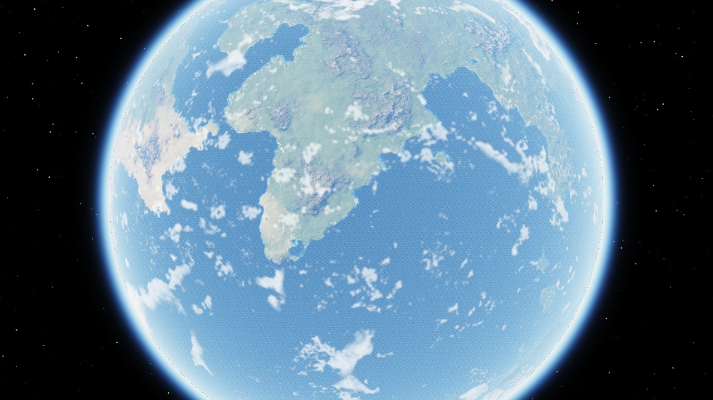
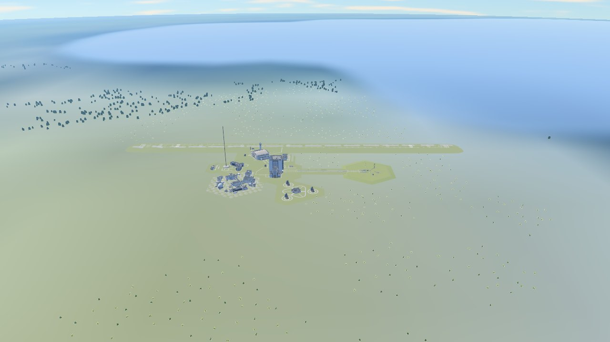
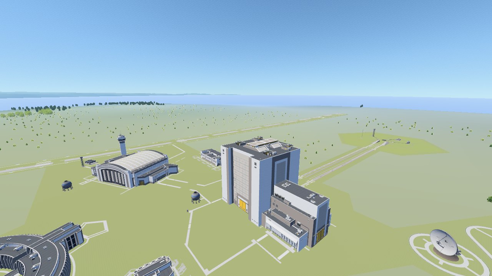
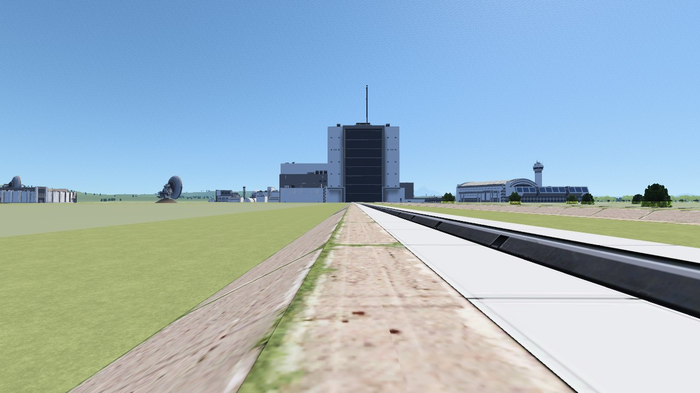
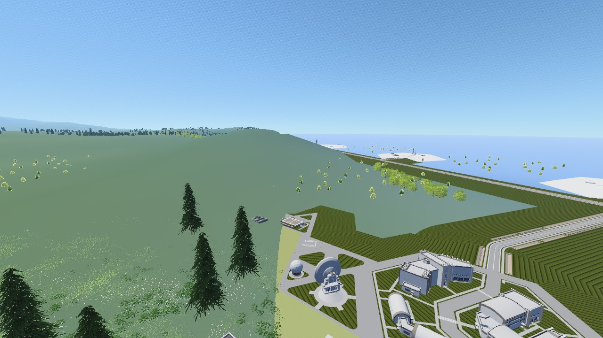
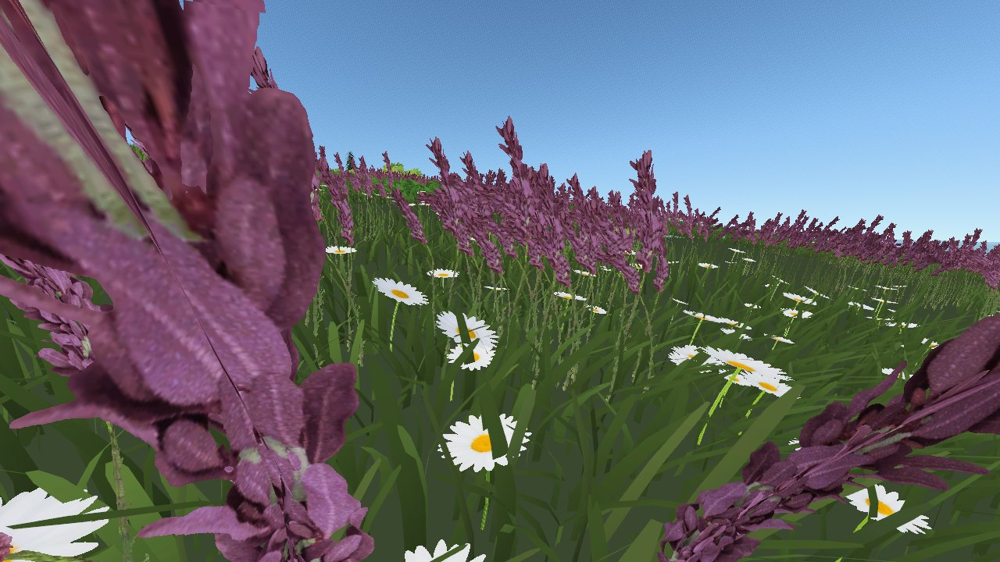
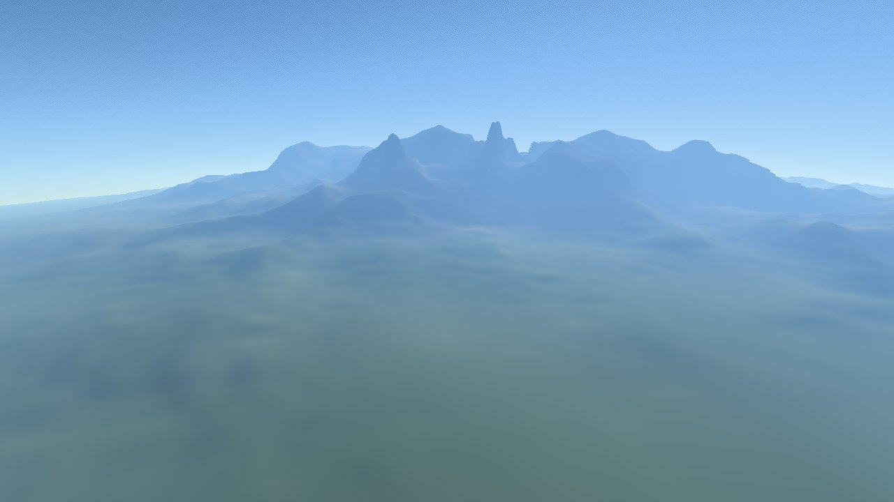
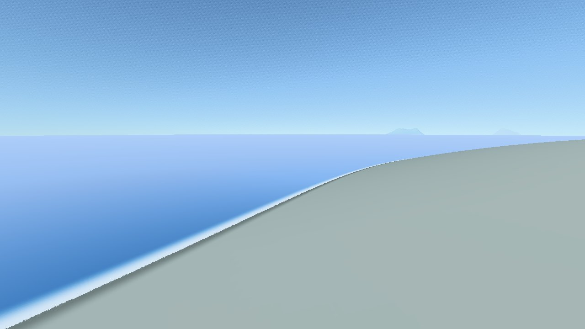

# Koogle Kerbin

El visor de Kerbin para Windows: mapa plano, globo 3D, biomas, alturas, herramientas,
órbitas y naves de una partida con su simulación en el tiempo, en un `.exe`. Nació como
la versión nativa de un visor web que vivió en este repositorio hasta la 1.6.10 (está
en la release `web-v1.6.10`) y fue mucho más allá: cualquier cuerpo
del sistema (de serie o de Kopernicus), día y noche con atmósfera física, la vista
del cielo desde la superficie, el foco de la cámara en una nave con su modelo
montado pieza a pieza, lo que la partida lleva escaneado con SCANsat, un filtro de
altimetría, waypoints que se escriben en la propia partida, un asistente de
aterrizaje, una calculadora de ventanas de lanzamiento y rutas con su tiempo por aire,
mar y tierra.

Está escrita en **C# con .NET 10**. La interfaz usa WinForms con controles
dibujados a mano con el tema oscuro del antiguo visor web, y el mapa, el globo y el
cielo se pintan con **OpenGL 3.3** llamado directamente. No usa ningún paquete
externo: compila sin conexión.

*This document is in Spanish. English overview of the project:
[../README.md](../README.md).*

<table>
  <tr>
    <td width="50%"><br><sub>El globo 3D con la capa de nubes de tu mod de nubes.</sub></td>
    <td width="50%"><br><sub>Bajando desde la órbita: a 3 km la cámara se inclina y se cargan el KSC, los árboles y los edificios.</sub></td>
  </tr>
  <tr>
    <td width="50%"><br><sub>El KSC de serie, leído de los datos del propio juego.</sub></td>
    <td width="50%"><br><sub>A ras de suelo en el camino de orugas, mirando al VAB y al SPH.</sub></td>
  </tr>
  <tr>
    <td width="50%"><br><sub>Tundra Space Center (Kerbal Konstructs) con los árboles y la hierba de Parallax.</sub></td>
    <td width="50%"><br><sub>Los scatters de Parallax de cerca: hierba, margaritas y flores, movidas por el viento.</sub></td>
  </tr>
  <tr>
    <td width="50%"><br><sub>Relieve de detalle: una tesela del mapa de alturas de Parallax a resolución completa alrededor de la cámara.</sub></td>
    <td width="50%"><br><sub>Las costas: aguas someras, espuma y arena mojada donde la tierra toca el mar.</sub></td>
  </tr>
</table>

*Capturas hechas por la propia aplicación, con KSP y los mods Parallax, Kerbal Konstructs, KSC Extended, Tundra Space Center y Stock Volumetric Clouds instalados.*

## Instalarla

Descarga `KoogleKerbin-Setup-<versión>.exe` de las *releases* del repositorio y
ábrelo. El asistente:

1. comprueba que el equipo tiene Windows de 64 bits y el **runtime de escritorio de
   .NET 10**; si falta, abre la página de descarga de Microsoft y detecta solo cuando
   lo has instalado;
2. instala para tu usuario, sin pedir administrador, en
   `%LOCALAPPDATA%\Programs\Koogle Kerbin` (o donde elijas), con accesos directos en
   el escritorio y el menú Inicio;
3. añade Koogle Kerbin a *Configuración › Aplicaciones* para desinstalarlo. Al
   desinstalar se borra solo lo que se instaló; tus ajustes y la partida guardada se
   conservan salvo que marques borrarlos.

Si ya estaba instalado, el asistente actualiza en la misma carpeta. Como el
instalador no está firmado, Windows SmartScreen puede avisar la primera vez: «Más
información › Ejecutar de todas formas».

Antes de instalar, una página ofrece **texturas extra (opcional)**: los mapas de los
planetas de Parallax (color y alturas de los 15 cuerpos, 234 MB) y sus texturas de
superficie (hierba, roca, arena y nieve de cerca para el vuelo, 1,9 GB), y su vegetación y
rocas en 3D (1,1 GB; de ese zip se guardan también los modelos `.mu`). Si ya las tienes
en tu KSP la página lo dice y no hace falta bajarlas. Son de su autor, Gameslinx, con
«todos los derechos reservados», así que **no van dentro del instalador ni se suben a
ningún sitio**: se bajan en tu equipo desde [la release oficial de Parallax
Continued](https://github.com/Gameslinx/Parallax-Continued/releases/tag/1.0.3), como haría
un gestor de mods, y de cada zip solo se guardan los paquetes de Unity y los `.cfg` en
`%LOCALAPPDATA%\KoogleKerbin\parallax`. Si una descarga falla, la aplicación queda
instalada igual y se avisa al final. Al desinstalar se borran. Las nubes no se ofrecen
porque son de un mod de pago.

Opciones para instalar sin ventanas: `/silent`, `/dir=<carpeta>`, `/noshortcuts`,
`/noregistry`, `/texturas=planetas,suelo,scatters` (sale con código 5 si alguna no se pudo bajar);
y `desinstalar.exe /uninstall /silent` para quitarlo.

**Actualizaciones automáticas.** Al abrir (como mucho cada 12 horas) el visor mira la última release de GitHub; si hay una versión nueva ofrece actualizar, omitirla o dejarlo para luego. Baja el instalador, comprueba su SHA-256 contra el que publica GitHub y lo lanza con `/update`: espera a que el visor se cierre, instala en la misma carpeta, rehace los accesos directos que tuvieras y vuelve a abrirlo. Solo se instala sola una copia que salió del instalador; una suelta avisa y abre la página de la release. Se apaga en el panel, sección «Actualizaciones». Para que funcione, el fichero de la release debe llamarse `KoogleKerbin-Setup-<versión>.exe`.

## Usarla

Abre Koogle Kerbin desde su acceso directo, o `dist\KoogleKerbin\KoogleKerbin.exe` si
lo has compilado tú. Junto al `.exe` va la carpeta `data\`
con los mapas y catálogos (la carpeta `data\` del repositorio): puedes cambiarlos
sin recompilar.

Requisitos del equipo:

- Windows 10 u 11 de 64 bits.
- El **runtime de escritorio de .NET 10** (Microsoft .NET Desktop Runtime 10).
- Una tarjeta gráfica con OpenGL 3.3, que es cualquiera de los últimos quince años.

También se le puede pasar un fichero al abrirla, por ejemplo arrastrando un
`persistent.sfs` o una imagen sobre el `.exe`, o desde la línea de órdenes:

```bash
KoogleKerbin.exe "C:\ruta\a\persistent.sfs"
```

Los ficheros también se pueden soltar directamente sobre el mapa: las partidas
(`.sfs`) cargan las naves y las imágenes van a su ranura según el nombre.

### Los mapas de Kerbin de tu instalación

Si encuentra KSP, «Datos del mapa» ofrece como primer mapa predeterminado **«De tu
instalación»**, y la primera vez lo elige solo en lugar del que hubiera (el que se había
cargado a mano no se pierde: se aparta a `%LOCALAPPDATA%\KoogleKerbin\slots\anteriores`). Se
lee del juego cada vez que se abre, sin copiarlo (`MapasDelJuego.cs`):

- **Color** de 8192×4096: la textura de Kerbin visto de lejos del propio juego
  (`KerbinScaledSpace300`, en `sharedassets2.assets`). Viene en BC7, que descomprime la GPU;
  si no sabe, se usa el de Parallax, que es el mismo a 4096.
- **Biomas** de 4096×2048: el mapa de atributos del juego (`kerbin_biome` en
  `sharedassets9.assets`), con el nombre de cada bioma. Los colores son los de siempre.
- **Altura** de 8192×4096: la del paquete de Parallax, con toda la escala de grises y su
  calibración (en Kerbin, de −1388 a 6744 m).

Los tres vienen en la convención de Unity (primera fila abajo, longitud al revés y girada
90°) y se dejan como los del visor, sin giro: contra el mapa de biomas de 1800 coinciden
en un 99 % los biomas y en un 95 % el color, y el KSC queda a 74 m y en «Shores», como en el
juego.

## Idioma

Español o inglés, en la sección «Idioma · Language» del panel lateral (la primera
vez, el de Windows). Cambiarlo reinicia el visor. Las traducciones están en
`data/i18n/en.json`, con el texto en español como clave: lo que falte se queda en
español, y se puede corregir sin recompilar. El instalador también tiene los dos
idiomas y deja el visor en el que se elija.

## Cuerpos celestes y sistemas personalizados

La sección «Cuerpo celeste», arriba del panel, elige el cuerpo que se ve. Al
cambiarlo pasan a ese cuerpo las naves de la partida, el Sol (con su latitud: la
órbita puede estar inclinada), la atmósfera, el día y la noche, la vista del cielo y
la ficha con sus datos.

- **Sistema de serie**: los 17 cuerpos de KSP, con los datos del juego (radio,
  gravedad, rotación, atmósfera, esfera de influencia y órbita), aunque no esté
  instalado. Cada uno con su color y su aire: Eve violeta, Duna rojizo, Jool verde.
- **Kopernicus** (OPM, RSS, SOL...): si la instalación de KSP lo usa, la lista sale de
  la caché de ModuleManager, ya con los parches del pack. Cada cuerpo hereda de la
  plantilla de serie que nombre y se le aplican sus `Properties`, `Orbit` y
  `Atmosphere`. La jerarquía (qué orbita a qué) y las esferas de influencia que no se
  indiquen se calculan.
- **La rotación** de cada cuerpo se mide con las naves de la partida que lo orbitan,
  como en Kerbin; sin ninguna, se usa la del juego.

Los mapas, biomas, alturas y marcadores que **trae** el visor son de Kerbin, pero los
demás cuerpos pueden tener los suyos: ver «Mapas de los demás cuerpos», más abajo. Sin
ellos, cada cuerpo se ve con su color y la retícula.

## Las cuatro vistas

Arriba a la izquierda, **2D**, **3D**, **Cielo** y **Vuelo**.

- **2D**: el mapa plano. De cerca (desde el zoom 9,5 y hasta el 16) el suelo lo pinta el
  renderizador del vuelo mirando en vertical, ver abajo.
- **3D**: el globo, con las lunas, los planetas y el Sol en su sitio para el instante de la
  barra de tiempo, a escala real: iluminados por el Sol (la Mun con sus fases), con su mapa
  de color de Parallax si lo hay, tapados por el planeta cuando quedan detrás y como un
  punto con su nombre los que de lejos miden menos de un par de píxeles (se apagan en
  «Vista 3D»). Al pinchar una nave, el foco de la cámara pasa del centro de
  Kerbin a la nave y la sigue: arrastrar gira alrededor de ella y la rueda se
  acerca o se aleja. Esc, F o pincharla otra vez devuelven el foco al planeta.
- **Cielo**: de pie en un punto de la superficie, mirando alrededor. Las naves
  cruzan el cielo con la barra de tiempo; sus órbitas se tapan con el horizonte.
  El punto se elige en la sección «Vista del cielo» (KSC, centro de la vista o un
  clic en el mapa) o con «Ver el cielo desde aquí» al pinchar en el mapa. El ojo nunca
  queda por debajo del suelo que se pinta (la altitud guardada puede ser de otro mapa de
  alturas, y la explanada del KSC y el relieve de detalle lo suben), y si cae sobre un
  edificio se pone encima: en el KSC, de pie en la plataforma de lanzamiento.
- **Vuelo**: una cámara libre a ras de suelo, con el relieve del terreno. Ver abajo.

## Día y noche

Las tres vistas iluminan Kerbin con el Sol en el instante de la barra de tiempo:
en 2D, la mitad de noche sombreada y un disco en el punto subsolar; en 3D, el
terminador con el atardecer rojizo y la atmósfera apagándose en la cara de noche;
en el cielo, el disco del Sol, el cielo azul de día, el horizonte encendido al
atardecer y las estrellas de noche. El HUD da la hora solar local (el día de Kerbin
dura 6 h: las 3:00 son mediodía) y, en el cielo, la altura del Sol. La nave
enfocada se queda a oscuras cuando entra en la sombra del planeta.

De dónde sale: Kerbin gira alrededor de Kerbol en una órbita circular sin
inclinación, así que su longitud es la anomalía media y el Sol está en la opuesta.
Es el mismo marco inercial que usan las órbitas de las naves, y la rotación del
planeta es la que el visor mide con ellas, de modo que el Sol queda coherente con
las posiciones de las naves. Sin partida cargada se toma el comienzo del juego
(UT 0). Se desactiva con «Día y noche» en «Capas» o en «Vista 3D», y en el cielo
«Forzar la noche» lo deja de noche para seguir mejor las naves. Las estrellas son
decorativas, pero giran con Kerbin como lo harían las de verdad.

## Atmósfera y superficie

El globo y la vista del cielo usan el mismo modelo de luz, con base física:

- **Dispersión atmosférica** de Rayleigh (el azul del cielo y el rojo de los
  atardeceres) y de Mie (la bruma y el halo del Sol), integrada a lo largo de cada
  rayo sobre los 70 km de atmósfera de Kerbin. Desde órbita se ve el borde azul del
  planeta y la bruma que come contraste hacia el limbo; desde el suelo, el cielo
  degradado, el horizonte encendido al ponerse el Sol y el paso a espacio al subir.
- **La luz del Sol llega filtrada** por el aire que atraviesa: la profundidad óptica
  sale de la aproximación de Schüler a la función de Chapman, que da también la
  sombra del planeta con su penumbra.
- **Relieve por píxel** a partir del mapa de alturas: las laderas se sombrean con
  más detalle que la malla, aunque el relieve exagerado esté a cero.
- **El mar** (`GlobeView.Agua.cs`), reconocido por el color del mapa desde fuera (o por
  la cota cero si no hay mapa de color) y por la geometría de cerca:
  - **Olas.** Dieciséis trenes de onda de 1,6 a 80 m, con la velocidad de las olas de
    aguas profundas (ω² = g·k, con la gravedad del cuerpo), el mar de fondo de un lado y
    el oleaje corto de cualquiera, y en grupos que suben y bajan como en el mar de verdad.
    Solo inclinan la normal (la superficie sigue siendo la esfera del océano), se mueven
    con el reloj real y no con el de la simulación, y están ancladas al mundo con la
    misma aritmética que las texturas del suelo, así que no tiemblan ni saltan al volar.
  - **El brillo del Sol** es una distribución de microfacetas de Beckmann con la rugosidad
    de Cox y Munk. Cada tren de olas se apaga cuando su longitud de onda ocupa pocos
    píxeles, y su pendiente pasa a esa rugosidad: de cerca se ven las olas y los destellos
    sueltos del camino del Sol; de lejos, el reflejo se ensancha solo hasta la gran mancha
    de brillo que se ve desde órbita, con zonas más lisas y más rizadas según el viento.
  - **El cielo reflejado** con Fresnel: a ras de suelo, el de verdad (el mismo aire que el
    cielo, en ocho pasos), con su color al atardecer.
  - **Transparencia.** El fondo se ve donde cubre poco: la luz que baja y sube se atenúa
    por canal (el rojo se pierde enseguida), así que la arena de la orilla pasa a turquesa
    y luego al color del mar abierto del mapa (en Eve, morado). Como el mapa de alturas es
    de 8 bits y el fondo baja a escalones, la profundidad se promedia para el color.
  - **Espuma** en la orilla, en líneas que llegan con las olas y se deshacen, y alguna
    cresta rota mar adentro cuando las olas se ven de cerca.
  - Se apagan en «Vuelo › Olas y espuma en el mar», y entonces queda el mar liso.
- **La costa**, a ras de suelo. Con relieve, lo que es mar lo decide la geometría (el
  rayo que da en la esfera del mar) y no el color, que a 1 km por texel teñía de azul la
  tierra de la orilla y la hacía brillar como agua. En tierra, donde el mapa aún dice mar
  y se está a menos de 20-40 m sobre el agua, una franja de arena, más oscura (mojada) en
  el último metro.
- **Estrellas** de fondo también en el globo; un cielo luminoso las tapa.
- La luz se calcula en lineal y se lleva a pantalla con un tonemapping filmic
  (ACES), así que ni el cielo ni el reflejo del mar se queman.
- **A ras de suelo la exposición es otra**, como la de una cámara que expone para el
  paisaje. Con el ajuste del globo, el suelo de mediodía se lavaba: la arena del
  desierto salía casi blanca, con saturación 0,10. En el cielo y en el vuelo el
  albedo baja un poco (compensando la luz ambiente, para que el crepúsculo quede
  igual), la curva va sobre la luminancia en vez de canal a canal, y el color se
  escala entero en lugar de recortarse. La misma arena sale ahora de color arena
  (saturación 0,30, sin ningún canal quemado), el mar deja de verse lechoso y la
  nieve sigue blanca. El globo visto desde fuera no cambia en nada: comparado píxel a
  píxel con el de antes, sale idéntico, porque allí manda la bruma y el ajuste de
  siempre funcionaba.

Con «Día y noche» apagado se vuelve a la vista plana de siempre, y con «Atmósfera»
apagada se quita el aire (sin bruma ni cielo sobre el globo).

## Las naves con sus piezas

Al seguir una nave en el globo, si te acercas lo suficiente se ve la nave de
verdad, montada pieza a pieza con los modelos y texturas de **tu instalación de
KSP** (se leen en su sitio; no se copia nada). La rueda acerca hasta pocos metros
y el doble clic salta directamente a una distancia en la que se ve entera.

Las **naves posadas, amerizadas o en la rampa** del cuerpo que se ve también salen en su
sitio en el vuelo, el cielo, el 3D de cerca y el 2D de cerca, montadas igual y pintadas
con los edificios (no hace falta tener encendidos los de Kerbal Konstructs). Como el
terreno de aquí no es exactamente el del juego, cada una se apoya en el suelo propio a la
altura sobre el terreno que guardó la partida (`hgt`); en una rampa o pista conocida
(`landedAt`, o en prelanzamiento) y en el agua se usa la altitud del juego, que ahí es
exacta. Respetan los tipos apagados en la lista de naves.

### Calidad gráfica

La primera sección del panel es un atajo para todo lo que cuesta dibujar: **Bajo**,
**Medio** y **Alto** encienden o apagan de una vez el detalle del suelo, los scatters (y su
densidad), el viento, las teselas de relieve, las nubes, los edificios y la distancia de
dibujado de scatters, edificios y naves en tierra (6, 15 o 25 km). «Alto» es el ajuste de
siempre. En cuanto se toca a mano cualquiera de esos controles, el preset pasa a
«Personalizado», y al abrir se comprueba que los ajustes guardados coincidan con el
preset elegido.

Cómo se monta, igual que hace el juego al cargarla:

- De la partida salen las piezas de cada nave, su posición y giro respecto a la
  pieza raíz, la orientación de la nave respecto a Kerbin y las variantes elegidas
  (`moduleVariantName` de las variantes de serie y `currentSubtype` de
  B9PartSwitch).
- De la caché de ModuleManager (`GameData/ModuleManager.ConfigCache`) sale qué
  modelos forma cada pieza ya con los parches de los mods aplicados (ReStock cambia
  los de serie, por ejemplo), con su escala y sus variantes. Sin ModuleManager se
  leen los `.cfg` tal cual.
- Los modelos `.mu` se leen con el formato que documenta io_object_mu, y las
  texturas DDS (DXT1/DXT5) se suben comprimidas tal cual a la GPU.

La carpeta de KSP se busca sola: la de la partida cargada o la de Steam por
defecto. Si está en otro sitio, «Carpeta de KSP…» en la sección de naves.

Comprobado con una partida de 196 naves y 928 piezas, con más de cien mods: el
catálogo se lee en menos de un segundo, 896 de las 928 piezas tienen malla y las 172
texturas que usan se leen todas. La orientación se contrastó con una nave posada:
su «arriba» cae a menos de 2° de la vertical del suelo en su posición.

Y del estado guardado de cada pieza:

- **Paneles, antenas, radiadores y demás desplegables**: la animación del modelo se
  evalúa en su punto (desplegada, plegada o a medias) y los paneles que siguen al
  Sol llevan el giro guardado. Las mallas que se doblan con huesos (paneles de
  lona, mástiles) se deforman con su esqueleto como en el juego.
- **Cubiertas de motor** (`ModuleJettison`): no salen si se desecharon o si no hay
  nada enganchado debajo.
- **Estructuras de interetapa** de las cofias (`ModuleStructuralNode`): solo si el
  juego las ha generado.
- **Placas de motores**: solo la malla del juego de nodos elegido.
- **Paracaídas** (de serie y RealChute de FAR): plegados solo se ve la tapa;
  abiertos, la campana en la pose de su animación; cortados, ninguna de las dos.
- Lo que el modelo marca como `Icon_Only` (la cofia de muestra del icono del
  editor) no se dibuja.

Lo que no se reproduce:

- **Piezas procedurales** (los paneles de las cofias, ProceduralParts) y
  **asteroides**: su forma se genera en el juego y aquí no aparecen. De una cofia
  se ve la base.
- **Recoloreados y cambios de textura** de TexturesUnlimited o de los subtipos de
  B9PartSwitch que solo cambian texturas: se ve la textura base del modelo.
- **La luz** es aproximada: el Sol del globo más una luz desde la cámara, sin
  brillos, mapas de normales ni sombras de unas piezas sobre otras.

## Mapas de los demás cuerpos

El visor solo trae mapas de Kerbin. **Si tienes Parallax Continued** (en tu KSP o bajado
por el instalador), los demás cuerpos salen con su color y sus alturas sin hacer nada: se
leen directamente de su paquete `parallax-stock-planet-textures.unity3d`, sin volcar
nada a PNG. Es un UnityFS de 2 GB comprimido en bloques LZ4; se abre en milisegundos
porque solo se descomprimen los bloques de la textura que hace falta, y el DXT se
descodifica en el visor. Las texturas de Unity van de abajo arriba; volteadas, son byte a
byte las del volcado, y a partir de ahí se tratan igual (espejo y 90°, ver abajo). Se
desactiva con «Usar las de Parallax si está instalado», y una carpeta elegida a mano
manda sobre Parallax para los cuerpos que tenga.

Si tienes volcadas a PNG las texturas de KSP (con
cualquier extractor de assets), en «Cuerpo celeste» → **Carpeta de mapas…** se apunta a
esa carpeta y cada cuerpo se ve con su mapa de verdad, sus alturas y sus biomas si los
hay. Se reconocen por el nombre: `Duna_Color.png`, `Mun_Height.png`,
`Eeloo_Biomes.png`… (los de normales se ignoran, y entre dos del mismo tipo gana el de
más resolución).

**Esas texturas vienen en espejo horizontal y giradas 90° en longitud**, y el visor lo
corrige solo. No es una suposición: se cuadraron las texturas contra los mapas de
biomas de la wiki comparando siluetas y bordes. Kerbin encaja al 95,6 % con
espejo + 90° (el control entre los dos mapas que ya traía el visor da 95,9 %), y el
mismo par sale en Duna, Eve, Laythe, Moho y Dres. Si tu volcado viene de otra
herramienta, los dos ajustes (`BodyMapOffset` y `BodyMapMirror`) están en los ajustes.

**La escala de gris a metros de esas texturas no es la de un export de SCANsat.** El
gris va del `minTerrainAltitude` del cuerpo a su `maxTerrainAltitude`, pero **con el
tope en el gris 145, no en el 255**. Los dos valores están tabulados en
`ParallaxScaled.cfg`, y el visor los lee de tu instalación y calibra cada cuerpo solo.

El 145 está medido: en los quince cuerpos del volcado el gris máximo va de 141 a 145, y
con ese tope la altura cae justo en el `maxTerrainAltitude` de cada uno. En Kerbin,
además, pone el KSC en **70 m** (su altitud real ronda los 70) y el mar abierto en
−1052 m, dentro de lo que da el mapa de SCANsat (−1090 a −935). Con la escala de SCANsat
(−1500 a 6500) ese mismo mapa pone el KSC en −684 m, que es el error típico al cargar un
volcado del juego en la ranura de altura.

Si has cargado uno de esos PNG a mano en «Altura», el botón **«Calibrar como volcado del
juego»** aplica esa misma regla al cuerpo que estés viendo. Sin Parallax instalado se usa
el rango de SCANsat, que para un export suyo es el correcto y para un volcado, una
aproximación.

## SCANsat, anomalías y modo progresión

La sección «SCANsat y progreso» lee de la partida lo que el juego ya sabe:

- **Cobertura de SCANsat** por cuerpo: lo que no has escaneado se tapa, en el mapa y en
  el globo. El mod la guarda como un `Int16[360,180]` comprimido con LZF dentro de una
  serialización de .NET; el descompresor de aquí se comprobó byte a byte contra el del
  propio mod (40 de 40 bloques idénticos) y el mapeo de celdas a lat/lon, con un
  guardado de cobertura parcial que sale como la banda ecuatorial que le corresponde.
- **Anomalías**: el catálogo (`data/anomalies.json`, 25 con coordenadas, del proyecto
  Kerbal Maps, Apache-2.0) se cruza con tu cobertura. Cada una sale como **sin
  detectar**, **detectada** (pasó el sensor de anomalías) o **identificada** (pasó
  también el de detalle), igual que en el juego. Se pueden mandar a la partida como
  waypoints.
- **Hitos** de `ProgressTracking`: qué cuerpos has alcanzado, sobrevolado, orbitado o
  pisado.

Con **modo progresión** el visor enseña solo lo descubierto: la cobertura tapa lo no
escaneado, las anomalías salen solo si las has detectado y los cuerpos sin visitar se
marcan en la lista. En sandbox se ve todo. Al cargar una partida que no sea sandbox, el
modo se propone solo.

## Filtro de altimetría

Se elige una franja de altura y el terreno que cae dentro se pinta con paleta de
altimetría (azul abajo, verde en las llanuras, blanco en las cumbres); el de fuera se
apaga. Va en las dos vistas y dice qué porcentaje de la superficie queda dentro,
pesando por `cos(lat)` (sin eso, los polos contarían muchísimo más de lo que ocupan).

Necesita mapa de alturas: el de Kerbin que trae el visor o el del cuerpo, de la carpeta
de mapas. La conversión de gris a metros es la de la ranura de altura, o la que SCANsat
tiene tabulada para ese cuerpo.

## Rutas: aire, mar y tierra

Un navegador al estilo de Waze: eliges origen y destino (con «Elegir en el mapa», en el
2D o en el globo, o entre los marcadores) y salen tres rutas con su distancia y su
tiempo, dibujadas a la vez y con la más rápida marcada:

- **Avión**: en línea recta por el gran círculo, con lo más alto que hay debajo. En un
  cuerpo sin atmósfera se da la distancia pero no el tiempo.
- **Barco**: solo por el mar. Si el origen o el destino quedan tierra adentro, la ruta
  empieza o acaba en el agua más cercana y se dice a cuánto.
- **Rover**: solo por tierra, sin cuestas de más de la pendiente máxima y más despacio
  cuanto más empinadas (a un 30 % de la velocidad en el límite). Da el desnivel
  acumulado y la pendiente más dura.

Las velocidades de crucero y la pendiente se cambian en el panel. Con una partida
cargada, cada ruta dice también la fecha de llegada partiendo del instante de la barra
de tiempo. Por debajo (`Core/Rutas.cs`) es una búsqueda A* sobre una rejilla de
4096×2048 celdas con la altura de cada una, hecha con los mapas que se vean, y el camino
se endereza después uniendo en recta los tramos que no tarden más.

## Waypoints en la partida

Tus marcadores —y las anomalías— se pueden escribir **dentro de la partida**, en el
nodo `ScenarioCustomWaypoints`, que es de donde KSP saca los waypoints del mapa y del
navball: no hace falta ningún mod. También se traen de vuelta como marcadores.

Tocar un `.sfs` es cosa seria, así que antes de escribir se hace copia de seguridad al
lado del fichero (`partida.sfs.bak-<fecha>`), se escribe en un temporal y se sustituye
al final. Si el waypoint ya existía se reemplaza **conservando su `navigationId`**, para
no duplicarlo ni perder el destino que tuvieras puesto en el juego. Y hay que cerrar
KSP antes: con el juego abierto, la partida está en memoria y se sobrescribe al guardar.

## Aterrizaje desde órbita

Con una nave en órbita del cuerpo y un objetivo en el suelo, «Aterrizaje» busca **cuándo
frenar** y **cuánto**, con una sola quemada retrógrada, e integra el descenso con RK4:
gravedad siempre y arrastre con atmósfera exponencial si el cuerpo tiene aire. Dibuja la
traza en el mapa y en el globo, y da el instante de la frenada, el Δv, el periapsis
resultante, la entrada en atmósfera, el punto de contacto y a qué distancia queda del
objetivo.

Sin atmósfera el cálculo es exacto salvo por el relieve. El error que queda es el
**físico**: con una sola quemada retrógrada no se cambia de plano, así que si la órbita
no pasa por encima del objetivo, lo mejor posible es la distancia de la traza al punto.
Medido en Mun sobre una partida real: el plan da 7,55 km de error y la traza de esa
órbita pasa a 7,54 km del objetivo.

Con atmósfera es una estimación —el frenado depende de la nave, y con FAR o Kerbalism el
modelo del juego no es este—; el coeficiente balístico (masa entre Cd por área) es el
mando para ajustarla.

## Transferencias y ventanas de lanzamiento

Se elige destino y el visor busca las salidas más baratas a partir del instante de la
barra de tiempo: **cuándo salir**, Δv de eyección desde la órbita de aparcamiento, Δv de
captura, tiempo de vuelo, **ángulo de fase** entre los dos cuerpos y **ángulo de
eyección** respecto al prógrado. Pinchar una ventana lleva la barra de tiempo a ese día.

Es lo mismo que hace el juego: cónicas parcheadas. La transferencia se resuelve con
Lambert (variables universales, funciones de Stumpff y bisección en `z`) sobre una
rejilla de instantes de salida y tiempos de vuelo, así que es **balística**: una sola
quemada, sin correcciones a medio camino. Vale entre planetas (con la estrella de cuerpo
central) y hacia una luna del propio cuerpo.

Contrastado con las cifras conocidas del sistema de serie, desde 100 km de aparcamiento:
Kerbin → Duna 1089 m/s y 309 días de vuelo con fase de unos 44° (lo publicado ronda
1050 m/s), Kerbin → Mun 842 m/s, Kerbin → Minmus 913 m/s, Kerbin → Eve 1026 m/s. Cada
búsqueda tarda menos de un cuarto de segundo.

## Vuelo: la cámara libre

Se vuela por encima del terreno como en un avión, pero sin nave: no hay inercia ni
se puede chocar, solo no deja bajar del suelo.

| Tecla | Qué hace |
|---|---|
| W / S | adelante y atrás, en la dirección en la que se mira |
| A / D | de lado |
| R / F, o espacio y control | subir y bajar |
| arrastrar | mirar alrededor |
| rueda | acelerador (de 2 m/s a 20 km/s) |
| mayúsculas | multiplica la velocidad por cinco |

El HUD da latitud, longitud, altura sobre el nivel del mar y **sobre el suelo**, rumbo,
velocidad y bioma. Al salir de la vista, la cámara se queda donde la dejaste.

**El terreno se traza por rayos, no con una malla.** A ras de suelo una malla necesitaría
teselado y niveles de detalle; aquí cada píxel avanza por el mapa de alturas hasta cruzar
la superficie, con pasos que crecen con la distancia y el cruce afinado por bisección. El
horizonte y las siluetas de las montañas salen exactos, y el mar se trata como una esfera
lisa al nivel del mar, así que el rayo no baja al fondo.

Dos detalles que costó afinar:

- **El mapa de alturas se sube sin filtrar**, porque los biomas se leen por color exacto.
  Aquí se interpola a mano con una curva quíntica: sin eso el terreno sale a escalones del
  tamaño de un texel, que en Kerbin son mesetas de 460 m.
- **Las derivadas de pantalla no sirven** para elegir el nivel de mipmap. Con relieve, la
  distancia al choque cambia de golpe entre píxeles vecinos (las siluetas) y encima se
  calcularían dentro de una rama que no todos los píxeles toman, que es justo lo que el
  lenguaje deja sin definir: el mipmap se iba al nivel más basto y el suelo salía de un
  gris plano. El nivel se calcula del tamaño que tiene el píxel sobre el suelo.

### Del globo al suelo, con la rueda

En la vista 3D la rueda ya no se para a 12 km: acerca la distancia al terreno (cada
muesca un 22 %) hasta 150 m del suelo. Por encima de 120 km se mira en vertical, como
siempre; al bajar la cámara se va inclinando hacia el horizonte, en escala logarítmica,
hasta unos 70° cerca del suelo, mirando al punto que se estaba viendo. Las flechas
izquierda y derecha giran el rumbo y arrastrar mueve el terreno en ese rumbo.

Por debajo de 1,1 radios (en Kerbin, 60 km) el planeta se pinta como en el vuelo, con el
suelo trazado por rayos, y lo que viste el terreno de cerca se carga la primera vez que se
baja, sin entrar en el vuelo: texturas de suelo, nubes, scatters y edificios. La
exposición se funde entre la del globo y la de paisaje entre 40 y 3 km, para que el
cambio no dé un salto. El nivel de detalle va con la distancia a todo: el relieve de
detalle con la altura (ver abajo), las texturas de suelo con la distancia de cada píxel,
los edificios hasta 25 km, y los scatters midiendo desde el ojo y no desde el suelo que
tiene debajo, así que desde arriba se generan menos y más ralos, y por encima del alcance
de cada tipo, ninguno.

### El 2D de cerca, visto desde arriba

De cerca el mapa plano ya no estira el mapa de color: el suelo lo pinta el
mismo renderizador que el vuelo, pero cada píxel lanza su rayo en vertical sobre su propia
latitud y longitud, así que sale en la proyección exacta del mapa. Lleva el relieve de
detalle, las texturas del juego y las costas, y los edificios se dibujan en planta con una
ortográfica (el este estirado 1/cos(lat), como en el mapa). Es un mapa, no una foto: sin
aire, sin nubes ni brillo del Sol en el agua, que mirando en vertical dejaba todo el mar
blanco, y con el agua iluminada como el suelo. La luz es la de un sombreado de relieve
(desde el noroeste a 45°) y la noche la pone encima el mapa, igual que sin esto.

El cambio apenas se nota: entre los zooms 9,5 y 10,5 el mapa plano se desvanece encima, y
del 10 al 12 este suelo pasa poco a poco del color del mapa tal cual a su luz y su detalle. Encima van la retícula (hasta
milésimas de grado), las trazas y los marcadores del 2D. Cuesta unos 6 ms por fotograma.

### Relieve de detalle: teselas

El mapa de alturas del cuerpo se sube entero a una resolución que cabe en memoria (en
Kerbin, el de SCANsat de 2048: 1,8 km por texel). Parallax trae el de Kerbin a 8192
(460 m por texel), pero entero serían 128 MB. Así que se guarda su versión cruda (R8, con
todos sus niveles de mipmap, 42 MB) y de ella se recorta una **tesela** de 1024×1024
alrededor de la cámara, del nivel que toque por altura: por debajo de 60 km el completo
(±235 km, más que el horizonte a esa altura), por debajo de 200 km el de la mitad, y más
arriba ninguno. Solo se usa un nivel si es al menos tan fino como el mapa base: a la misma
resolución, la tesela sigue ganando a un PNG volcado del juego, cuyo gris tiene el tope en
145 (56 m por escalón en Kerbin: la tierra baja de la costa se hundía bajo el mar o salía
como arena). Se rehace en segundo plano al alejarse de su centro, y se funde con el mapa
base en el borde.

Tres detalles que se notaban:

- El gris es de 8 bits (32 m por escalón en Kerbin): en las zonas llanas se suaviza con
  una gaussiana de 2 texeles, solo donde apenas hay dos o tres grises distintos, para que
  los escalones no salgan como terrazas; donde hay relieve de verdad no se toca.
- Se interpola con Catmull-Rom entre 4×4 texeles, en la GPU y en la CPU con la misma
  cuenta (lo que se coloca en el suelo tiene que coincidir con lo que se pinta). La curva
  quíntica del mapa base se queda plana en cada texel, y a 460 m eso se ve como bandas en
  la luz de las laderas.
- La marcha del rayo avanza según la holgura sobre el terreno, con un mínimo que crece
  con la distancia, en lugar de 128 pasos fijos: con pasos fijos, las crestas finas de
  lejos se saltaban y las siluetas salían a escalones.

Al bajar en la vista 3D se pinta con el mismo relieve y las mismas texturas que el vuelo
(antes el renderizador de cerca solo las activaba en el vuelo y en el cielo, y el 3D de
cerca salía liso y con el mapa de color estirado).

En las costas, el agua que el relieve pone donde el mapa de color aún pinta tierra toma el
color del mar abierto de al lado (`MapaDelMar.cs`: un mapa de medio grado con la media de
los texeles azules a más de 30 m de profundidad, extendida hacia tierra), y el tono por
profundidad se atenúa exponencialmente, como la luz en el agua. Con el color del mapa, sus
texeles de costa, mezcla de azul y arena, dejaban un anillo oscuro y un halo arenoso a lo
largo de toda la orilla.

Cuesta poco: en una RTX 5060 a 1280×720, 1,7 ms por fotograma con la tesela frente a 1,5
sin ella, y 6,5 ms bajando al KSC con edificios, scatters y nubes.

Al leer estos mapas del paquete de Parallax salió otra cosa: ahí el gris usa toda la
escala (0 y 255 son el mínimo y el máximo del terreno; el KSC queda a 79 m), mientras que
el tope en el gris 145 es de los volcados a PNG. Los mapas de los demás cuerpos leídos del
paquete salían 1,76 veces más altos; ahora cada fuente usa su calibración.

### Texturas de suelo y nubes, del juego

De cerca, el mapa del cuerpo no da más de sí: un texel son cientos de metros. Encima se
pone una textura que se repite cada pocos metros, elegida por la pendiente y por el color
del sitio (hierba en lo verde, arena en lo claro, roca en lo empinado, nieve en lo
blanco), y que se desvanece a partir de un kilómetro y medio para que no haga muaré.

**Con Parallax Continued** se usan las suyas, las de cada cuerpo (la hierba de Kerbin, el
regolito de la Mun, la arena roja de Duna...), mezcladas como las mezcla el mod: baja,
media y alta según la altitud, con los umbrales en metros de su `Terrain.cfg`, y la de
pendiente con su potencia, contraste y punto medio; la escala de repetición también es la
suya. Se leen de su paquete de Unity (solo los niveles de hasta 2048 de ancho). Sin
Parallax se usan las del **Community Terrain Texture Pack**, elegidas por el color del
sitio.

**Variación de texturas.** El suelo se pinta como lo pinta el shader de terreno de
Parallax (`Parallax.shader` y `ParallaxUtils.cginc` en su código):

- **Proyección biplanar** en coordenadas del mundo: la textura va sobre los dos planos de
  los ejes que más miran hacia la normal, así no se estira en las laderas. Las
  coordenadas salen de la posición del ojo reducida módulo un múltiplo de todos los
  periodos, con lo que la textura queda clavada al suelo sin perder precisión (antes se
  deslizaba al volar en latitudes medias).
- **Dos escalas según la distancia**: cerca la textura se repite más a menudo y lejos
  menos, en potencias de dos, fundidas entre sí.
- **Mapa de influencia**: cuánto manda cada textura frente al color del planeta. Donde
  manda poco queda el color del mapa con el dibujo de la textura; en Kerbin la hierba es
  casi toda así, igual que en el juego.
- **Mezcla por desplazamiento**: en la transición entre dos texturas gana la de más relieve
  en cada punto (la hierba asoma entre las piedras).
- **Oclusión y mapas de normales** de cada textura: el relieve fino que les da luz y sombra.
- Encima, la **variación antimosaico** de Inigo Quilez: cada zona lee la textura con un
  desplazamiento distinto elegido por un ruido suave, y el mosaico deja de verse repetido.
  Se apaga con «Variación de texturas».

### Scatters de Parallax: hierba, árboles y rocas

Con `Parallax_StockScatterTextures` (en tu KSP o bajado por el instalador) el suelo se
llena de lo que pone el mod: hierba, helechos, margaritas, rosales, arbustos, robles, pinos,
palmeras, cactus y baobabs en Kerbin; rocas en la Mun, Minmus, Duna, Ike, Eeloo...; losas y
cristales en otros. Son sus modelos `.mu` y sus texturas, leídas del paquete de Unity.

**Dónde va cada uno** sigue las reglas del mod (`TerrainScatters.compute` en su código): por
cada trozo de terreno, `populationMultiplier` candidatos al azar; cada uno sale o no según
una probabilidad que baja con la pendiente y cerca de los límites de altitud, según un
ruido fractal sobre la esfera por encima de un umbral (que además decide el tamaño) y
según la lista de biomas en los que no sale. Aquí no hay triángulos del terreno de KSP, así
que se reparte por celdas de latitud y longitud con los candidatos que tendría un triángulo
de su nivel más fino (unos 2150 m²), y lejos hay menos, como en el juego, donde el terreno
lejano es más basto. Las celdas se generan en segundo plano y todo es determinista: al
volver a un sitio están los mismos árboles. Las copas (los `SharedScatter`) van sobre sus
troncos con el mismo tamaño.

Los biomas de Kerbin se identifican por su color en el mapa de biomas del juego, con los
nombres que usa el mod («Grasslands», «Deserts»...). En los demás cuerpos esa lista no se
aplica, porque su mapa de biomas no dice los nombres.

**Cómo se pintan.** El suelo se traza por rayos y no tiene malla, así que el shader del
cielo escribe en el búfer de profundidad dónde choca cada rayo y los modelos se pintan
encima con prueba de profundidad: una colina tapa los árboles de detrás. La profundidad va
en escala logarítmica en los dos sitios; con la lineal, a diez kilómetros el búfer de 24
bits no distingue 30 m. Cada objeto se pinta con su nivel de detalle según la distancia y
con los límites de objetos por nivel del propio mod, instanciado. Las hojas y briznas dejan
pasar parte de la luz que les da por detrás. En una RTX 5060 a 1500×900, con unos 30 000
objetos a la vista junto al KSC, el cielo tarda unos 3 ms y los scatters unos 5.

**El viento** mueve la hierba, los helechos y las copas como en el mod (`Wind` en su
`ParallaxScatterUtils.cginc`): un mapa de ruido que se desplaza con el tiempo, leído en los
tres planos del mundo según la vertical, empuja cada vértice de lado y un poco hacia arriba
según su altura dentro del modelo, con la escala, velocidad e intensidad que da cada
material. Mientras se vea algo que se mueva el visor pinta sin parar; si no, vuelve a pintar
solo cuando cambia algo. Se apaga con «Viento en la vegetación».

Lo que no se reproduce: las burbujas de Eve (refractan lo que tienen detrás) y
las sombras de unos objetos sobre otros. La densidad se puede bajar en «Densidad de los
scatters».

Las **nubes** salen del mapa de los mods de nubes que tengas (Stock Volumetric Clouds,
EVE): una capa esférica a la altura que elijas, con la cobertura del propio mapa e
iluminada por el Sol. Ese mapa es de 16384×8192 y pesa 179 MB con sus mipmaps, así que se
lee desde el **nivel de 8192 de ancho** (43 MB en la GPU, 5 km por texel), y de cerca lo
completa la textura de detalle del mod (`detail1`), que va con el viento.

Las nubes **se mueven y cambian de forma**, como en el juego. La capa gira hacia el oeste a
la velocidad de su `clouds.cfg` (en Kerbin, 29,9 m/s en superficie: una vuelta cada 35 h), y
el mapa se muestrea desplazado por un ruido suave sobre la esfera que evoluciona con el
tiempo (unos 80 km en celdas de 100 km), con la cobertura subiendo y bajando por zonas: los
frentes se deforman, se forman y se deshacen (`GlobeView.Nubes.cs`). El tiempo es el de la
simulación, así que con la barra de tiempo acelerada se ve pasar el tiempo atmosférico, más
el reloj real, para que en pausa sigan moviéndose al ritmo de x1.

La misma capa se ve también **en el globo 3D**, por encima del suelo y con la bruma del
aire que queda entre la cámara y la nube. Con el relieve exagerado sube con él, para que
las montañas no la atraviesen. Se apaga con «Nubes» en «Vista 3D».

Todo se apaga por separado en la sección «Vuelo», y sin esos mods instalados el vuelo
funciona igual: el suelo de cerca queda liso, sin vegetación y sin nubes.

## Edificios de Kerbal Konstructs

Si tu KSP tiene **Kerbal Konstructs** y paquetes de bases (KSC Extended, Tundra Space
Center, Kerbin Side...), el visor lee sus `.cfg` de GameData: los modelos (`STATIC` con
su `.mu`), los centros de grupo (`KK_GroupCenter`) y cada edificio (`Instances`). Los
parches de ModuleManager (`@STATIC`...) no se aplican. Con los paquetes de la instalación
de prueba son 164 ficheros, 111 modelos y 137 edificios, leídos en menos de un segundo.

**Dónde va cada uno** sale de las mismas cuentas que hace KK en el juego (su
`GroupCenter.cs` y `StaticInstance.cs`): el centro del grupo, a su latitud y longitud y a
`RadiusOffset` metros sobre el terreno (o sobre el mar con `SeaLevelAsReference`),
orientado con `LookRotation(vertical) · Euler(0, 0, Heading) · Euler(−90, −90, −90)`; y cada
edificio, hijo del grupo con `RelativePosition`, `Orientation` y `ModelScale`. Los grupos
«del juego» (`KSC_Builtin`, `IslandAirfield_Builtin`, `Desert_Airfield_Builtin`...) no están
en ningún `.cfg`: van con los valores de los PQSCity de Kerbin. También se entiende el
formato antiguo (`RadialPosition`, `RotationAngle`) y los grupos que faltan, que KK crea en
la posición del edificio.

**Cómo se ven.** Los grupos salen como marcadores en el mapa y en el globo, y en la
sección «Edificios (Kerbal Konstructs)» con cuántos edificios tiene cada uno; un clic lleva
a él y «Volar aquí» deja la cámara de vuelo mirándolo. En el vuelo y en el cielo se ven
con sus modelos, que se cargan en segundo plano la primera vez que hacen falta, pintados
como los scatters: relativos al ojo, con la profundidad logarítmica del suelo trazado (una
colina tapa un hangar) y con la luz y la bruma del suelo. Muchos paquetes reutilizan las
texturas del KSC de serie («model_vab_exterior_tile_00», el asfalto...), que no están en
GameData sino en los datos del juego (`KSP_x64_Data/sharedassets*.assets`): se indexan por
nombre, como las busca KK, y se leen de ahí con su `.resS`. También se aplican los módulos
`AdvancedTextures` que cambian la textura de partes del modelo.

**Editarlos.** Con «Editar edificios», un clic sobre un edificio en el vuelo o el cielo lo
elige (se prueba contra sus triángulos, no contra una caja) y se resalta. Se mueve
respecto a hacia dónde mira la cámara, con el paso que elijas (0,1 a 100 m), se sube, se
baja o se deja al ras del suelo, se gira alrededor de la vertical, se escala, se duplica o
se borra; y de la lista de modelos se pone uno nuevo 60 m delante de la cámara, que entra
en el grupo más cercano (a menos de 25 km, como en KK) o en uno nuevo. Teclas con uno
elegido: I/K adelante y atrás, J/L a los lados, U/O bajar y subir, Q/E girar, Supr borrar,
Esc soltar.

Nada toca el disco hasta **«Guardar en los .cfg»**. Entonces no se reescribe el fichero
entero, sino que se localiza el nodo en el texto y se cambian solo sus líneas
(`RelativePosition`, `Orientation`, `ModelScale`), se quita su bloque `Instances` o se
añade uno; lo demás (comentarios, `LaunchSite`, `Facility`, módulos) queda igual. Los
edificios nuevos van a `KerbalKonstructs/NewInstances/<modelo>-instances.cfg` y los grupos
nuevos a `KK_GroupCenter_<cuerpo>_<grupo>.cfg`, donde los pone KK. Antes de tocar un
fichero se copia a `%LOCALAPPDATA%\KoogleKerbin\kk-copias\<fecha>\` con su ruta dentro de
GameData, y si ha cambiado en disco desde que se leyó (KSP abierto guardando, por ejemplo)
no se toca. Mejor editar con KSP cerrado. Al salir con cambios sin guardar, se pregunta.

### El KSC de serie

Los edificios del propio juego no tienen `.mu`: son prefabs de Unity dentro de
`KSP_x64_Data/sharedassets9.assets`, uno por nivel de cada instalación, y ese fichero no
lleva la descripción de sus tipos. Se leen con la disposición de Unity 2019.4 escrita a
mano (`StockPrefabs.cs`): GameObject y Transform para la jerarquía, MeshFilter y
MeshRenderer, Material con sus texturas, y Mesh con sus canales de vértices, índices de 16
o 32 bits y datos en el `.resS` si hace falta, siguiendo las referencias a otros ficheros
del juego (`sharedassets0.assets`...). Qué instalaciones hay, dónde está cada una dentro del
centro y qué prefab es cada nivel lo dice el prefab `KSC`: un hijo por instalación con su
script `UpgradeableFacility`. Leer los 36 modelos cuesta unos milisegundos cada uno.

Con eso se ven dos cosas. **El KSC**, cada instalación en su sitio dentro del grupo
`KSC_Builtin` (la plataforma de lanzamiento cae a 3 m de sus coordenadas conocidas y la
pista queda este-oeste, como en el juego), al nivel que diga la partida cargada
(`ScenarioUpgradeableFacilities`) o al más alto si no dice nada. Y **las copias de KK**
(`KSC_Runway_level_2`, `KSC_FuelTanks`, `KSC_WaterTower`...), que usan esos mismos modelos con
el nombre que les da KK; también salen en la lista del editor para ponerlas. Los
edificios del KSC de serie no se mueven ni se borran (no están en ningún `.cfg`), pero
«Duplicar» hace de uno una instancia normal de KK.

El césped del KSC usa el shader «Diffuse Ground KSC» del juego: hierba repetida y teñida con
`_GrassColor`, y asfalto donde lo diga una máscara. La máscara va por el segundo canal de
UV de la malla (que cubre la explanada entera de 0 a 1), y viene comprimida en **Crunch**, la
variante de Unity (formatos 28 y 29): dos paletas, de extremos y de selectores DXT, e
índices a ellas por bloque con Huffman, agrupados de 2×2 con una referencia que dice si el
bloque trae extremos nuevos o repite los de al lado. `Crunch.cs` lo deshace hasta los
bloques DXT de siempre, que van tal cual a la GPU; en el juego son 35 texturas, casi todas
estas máscaras, y se leen a 1024 (unos 250 ms cada una). Como el mapa de alturas (1,8 km por píxel) no recoge la explanada sobre la que
está el KSC, el terreno se allana a la altura de sus céspedes hasta 2 km del centro y se
funde con el de alrededor hasta 3,5 km, en el suelo que se pinta y en las cuentas de la
cámara, la colocación y los scatters, que dentro no salen, como en el juego.

Lo que aún no: el césped de las bases
de KK sale con su textura, sin el tinte (`GrassColor`) ni su máscara; los edificios del
formato antiguo se ven pero no se editan; y del juego no se pintan las mallas con
esqueleto (dos piezas de la plataforma de nivel 3).

## Países y facciones

La sección «Países y facciones» es un creador de mapas políticos: países, facciones o lo
que quieras repartirte, cada uno con su nombre y su color, pintados sobre el cuerpo que se
ve. Cada cuerpo tiene su propio mapa.

- **Solo sobre tierra.** El mar no es de nadie: lo que se pinta se recorta por la costa al
  dibujarlo, con la costa del mapa que se esté viendo (la del mapa de color de lejos y la
  del relieve de cerca, que es más fina que la rejilla). En un cuerpo sin mar, como la
  Mun, todo es superficie.
- **Cuatro herramientas.** El *pincel* pinta arrastrando, con un radio de 1 a 316 km
  (`[` y `]` lo cambian); el *relleno* se queda con la isla, o con la zona cerrada por
  fronteras, donde hagas clic; el *polígono* va vértice a vértice y se cierra con doble
  clic, Intro o pinchando en el primero (Retroceso quita el último); la *goma* borra.
  Con «No pisar el territorio de otras facciones» marcado, nada se come lo que ya es de
  otro, y la goma solo borra lo de la facción elegida.
- **En el mapa 2D y en el globo**, también bajando hasta el suelo (de cerca, el cursor
  sigue el relieve). Con una herramienta activa, el botón izquierdo pinta y el derecho
  mueve el mapa; Esc la suelta y **Ctrl+Z** / **Ctrl+Y** deshacen y rehacen (hasta 40
  pasos).
- **Como un mapa político**: relleno translúcido que se intensifica junto a la frontera,
  una raya de frontera del mismo grosor a cualquier zoom (cada mitad del color de su lado)
  y el nombre de cada territorio en su punto más hondo, del tamaño que quepa. Se sigue
  leyendo de noche. El HUD y el clic en el mapa dicen de quién es cada sitio, y la lista
  la superficie de tierra de cada facción.
- **Se guarda solo**, en `%APPDATA%\KoogleKerbin\facciones-<cuerpo>.json`. «Exportar» e
  «Importar» usan ese mismo fichero, para pasárselo a otro; «Imagen PNG» saca el mapa
  político como una equirectangular de 4096×2048 con transparencia en el mar.

Por dentro (`Core/Facciones.cs`, `Views/FaccionesGlsl.cs`) es una rejilla equirectangular
de 4096×2048 celdas (920 m en el ecuador de Kerbin) con el número de la facción de cada
una. Cada píxel mira las cuatro celdas que lo rodean: con los pesos de la interpolación
bilineal gana la facción que más pesa y la frontera es donde empatan las dos que más pesan;
como esa mezcla es lineal dentro de la celda, su gradiente da la distancia a la frontera
en píxeles, y por eso la raya no sale a escalones. Una máscara de tierra (del mapa de
alturas, o del de color) le dice al relleno qué es una isla y cuenta la superficie. Lo que
el pincel deja sobre el mar se guarda pero no se ve: si se cambia de mapas y la costa se
mueve un poco, el territorio sigue llegando hasta el agua.

## Controles

| Acción | Cómo |
|---|---|
| Mover el mapa, girar el globo, o mirar alrededor en el cielo y en vuelo | arrastrar |
| Zoom (en el cielo, el campo de visión) | rueda; doble clic acerca en 2D; `+`/`-` y flechas con la vista enfocada |
| Información de un punto | clic en el mapa |
| Seguir una nave | clic en ella (en el mapa, el globo o la lista) |
| Soltarla | Esc, F, o clic otra vez en ella |
| Datos de su órbita (altitud, velocidad, Ap/Pe y cuánto falta, periodo, elementos) | I o «Órbita» en la barra de tiempo |
| Pausa / continuar | espacio |
| Más rápido hacia delante / hacia atrás | `.` / `,` |
| Salir de una herramienta o de «Elegir en el mapa» | Esc |
| Pintar territorios (con una herramienta de «Países y facciones») | arrastrar o clic; botón derecho para mover el mapa |
| Radio del pincel / deshacer / rehacer | `[` `]` / Ctrl+Z / Ctrl+Y |

## Dónde guarda las cosas

- `%APPDATA%\KoogleKerbin\`: `settings.json` (capas, vista, ventana, observador
  del cielo), `markers.json` (tus marcadores), `biomes.json` (los nombres de
  bioma) y `facciones-<cuerpo>.json` (el mapa político de cada cuerpo).
- `%LOCALAPPDATA%\KoogleKerbin\slots\`: una copia de las imágenes que cargas a
  mano, para que sigan ahí la próxima vez. Las de `data\` no se copian.
- `%LOCALAPPDATA%\KoogleKerbin\kk-copias\`: la copia de cada `.cfg` de Kerbal
  Konstructs antes de que el editor de edificios lo cambie, por fecha.
- `%LOCALAPPDATA%\KoogleKerbin\partida\persistent.sfs`: una copia de la última
  partida cargada. Al abrir el visor se carga sola, en el instante de la barra de
  tiempo en que se cerró; «Recargar del juego» vuelve a leer el original por si has
  jugado desde entonces.

Si quedan las carpetas `KerbinMaps` de cuando la app se llamaba así, se renombran
solas la primera vez. Borrar las carpetas deja la aplicación como recién instalada.

## Compilar

Con el SDK de .NET 10:

```bash
powershell -ExecutionPolicy Bypass -File publicar.ps1
```

Deja el resultado en `dist\KoogleKerbin`. El instalador se construye encima:

```bash
powershell -ExecutionPolicy Bypass -File installer\construir.ps1
```

Publica, mete `dist\KoogleKerbin` en un zip dentro del instalador y lo compila
(`installer\Instalador.cs`) contra .NET Framework 4.8 con el compilador de C# del SDK,
sin descargar nada: queda en `dist\KoogleKerbin-Setup-<versión>.exe`. Va sobre .NET
Framework, que ya trae Windows, para poder arrancar en un equipo sin .NET 10 y
avisar de que falta. Para depurar basta con
`dotnet build` y ejecutar lo que queda en `bin\Debug\net10.0-windows`; mientras
se desarrolla, la app encuentra `data\` subiendo carpetas hasta la raíz del
proyecto.

## Cómo está organizado

| Carpeta | Qué hay |
|---|---|
| `src\Core` | Lo que no depende de la pantalla (también las teselas de relieve, `TeselaAltura.cs`, y las explanadas, `Aplanado.cs`): geodesia, Kepler, lectura de partidas y calibración de la rotación, imágenes (sonda, paleta de biomas, giro automático), catálogo y almacenamiento. Empezó como traducción del antiguo visor web, más lo que aquel no tenía: sistema solar (`SolarSystem.cs`), SCANsat (`ScanSat.cs`), el resto de la partida (`SaveExtras.cs`: hitos y waypoints), anomalías, mapas por cuerpo, descenso (`Landing.cs`) y transferencias (`Transfer.cs`, con Lambert). |
| `src\Gfx` | Enlaces a OpenGL, el control con el contexto (con antialias multimuestra), shaders, texturas, dibujo 2D por lotes y rótulos. |
| `src\Views` | El mapa plano, el globo (`GlobeView.cs`, con sus tres modos de cámara), el cielo (`GlobeView.Sky.cs`), el modelo de la nave enfocada (`VesselModelRenderer.cs`, en metros y relativo a la cámara para que no tiemble), los scatters de Parallax (`ScatterField.cs` los reparte en segundo plano; `GlobeView.Scatters.cs` los pinta) y los edificios de Kerbal Konstructs (`GlobeView.Statics.cs`, con la elección por clic); `ModelGpu.cs` sube mallas y texturas para los dos. |
| `src\Ksp` | Lectura de la instalación de KSP: ConfigNode, modelos `.mu`, texturas DDS/TGA/PNG, catálogo de piezas y montaje de naves, los paquetes de Unity de Parallax (`UnityBundle.cs`: UnityFS con LZ4 y acceso aleatorio por bloques, y también los `.assets` sueltos del juego; `DxtDecoder.cs`; `ParallaxPlanets.cs`, `ParallaxTerrain.cs` y `ParallaxScatters.cs`), las texturas de serie (`StockAssets.cs`) y Kerbal Konstructs (`Konstructs.cs` lee y coloca; `KonstructsWriter.cs` guarda) y los edificios del KSC sacados de los datos de Unity (`StockPrefabs.cs`). |
| `src\UI` | La ventana, el panel lateral y los controles de tema oscuro. `MainForm` está repartida en ficheros por tema: mapas, naves, herramientas, cielo, etc. |

Decisiones que no son evidentes:

- **Sin costuras ni teselas en el mapa plano.** Un shader calcula la latitud y
  longitud de cada píxel y lee la textura, con el desfase de longitud aplicado
  ahí. Las copias del mundo salen solas y las líneas se pintan continuas en vez
  de partirse por el antimeridiano.
- **El cielo es trazado de rayos, no una malla.** Desde unos metros de altura el
  búfer de profundidad no distingue el suelo de una órbita a cientos de
  kilómetros, y los triángulos de la esfera se verían en el horizonte. Cada píxel
  lanza un rayo contra la esfera: el horizonte sale exacto y las órbitas se tapan
  con el mismo corte, hecho por vértice.
- **Las transiciones entre modos interpolan el ojo por la esfera**, dirección y
  radio por separado, para que la cámara no atraviese el planeta.
- **Un clic en una nave la selecciona sin abrir además la información del punto**,
  que en el antiguo visor web salía a la vez.
- **Los nombres de bioma se ponen pinchando la fila de la leyenda**, en vez de
  escribirlos en una casilla dentro de la lista.
